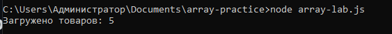
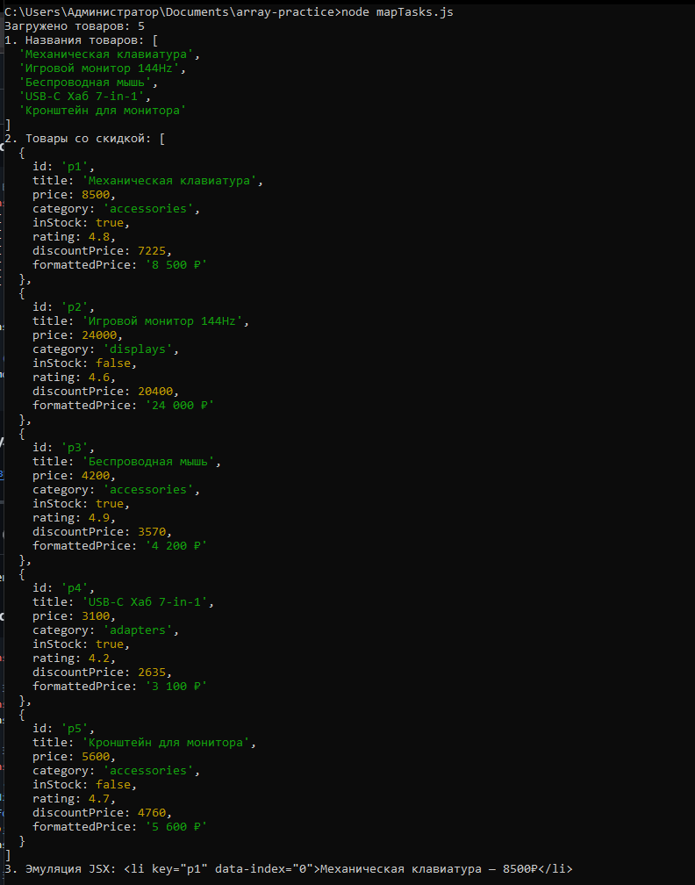
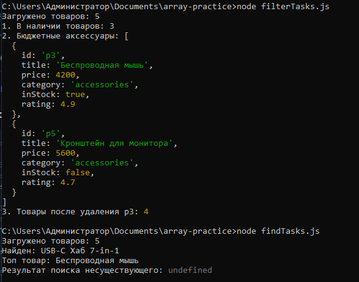
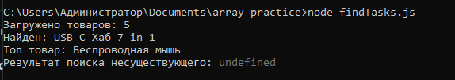
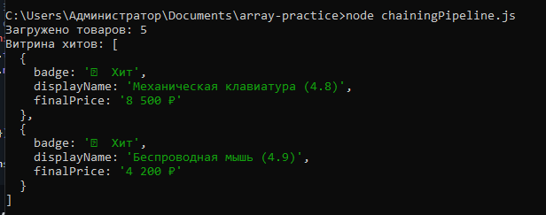
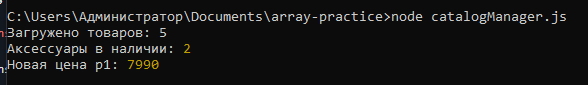

# Практическая работа №4: Массивы и методы map, filter, find

Репозиторий содержит выполнение практической работы по отработке функциональных методов массивов JavaScript (`map`, `filter`, `find`), композиции методов (method chaining) и созданию модуля бизнес-логики каталога.


## 01. Подготовка тестового стенда (`array-lab.js`)

Создание тестового набора данных интернет-магазина и экспорт для использования в последующих модулях.

### Исходный код:

```javascript
// Базовый массив товаров (эмуляция ответа сервера):
const products = [
  { id: "p1", title: "Механическая клавиатура", price: 8500, category: "accessories", inStock: true, rating: 4.8 },
  { id: "p2", title: "Игровой монитор 144Hz", price: 24000, category: "displays", inStock: false, rating: 4.6 },
  { id: "p3", title: "Беспроводная мышь", price: 4200, category: "accessories", inStock: true, rating: 4.9 },
  { id: "p4", title: "USB-C Хаб 7-in-1", price: 3100, category: "adapters", inStock: true, rating: 4.2 },
  { id: "p5", title: "Кронштейн для монитора", price: 5600, category: "accessories", inStock: false, rating: 4.7 }
];

console.log(`Загружено товаров: ${products.length}`);

if (typeof module !== "undefined") {
  module.exports = { products };
}
```

### Результат выполнения (`node array-lab.js`):



---

## 02. Отработка метода `.map()`: Трансформация структуры (`mapTasks.js`)

Проекция данных: извлечение названий, пересчет стоимости со скидкой и формирование JSX-разметки.

### Исходный код:

```javascript
const { products } = require("./array-lab.js");

// Задача 1: Получить простой массив только из названий всех товаров:
const productTitles = products.map(item => item.title);
console.log("1. Названия товаров:", productTitles);

// Задача 2: Добавить скидку 15% и отформатировать цену для отображения:
const productsWithDiscount = products.map(item => ({
  ...item,
  discountPrice: item.price * 0.85,
  formattedPrice: `${item.price.toLocaleString("ru-RU")} ₽`
}));
console.log("2. Товары со скидкой:", productsWithDiscount);

// Задача 3: Превратить массив объектов в массив JSX-строк (эмуляция React List):
const mockJsxList = products.map((item, index) =>
  `<li key="${item.id}" data-index="${index}">${item.title} — ${item.price}₽</li>`
);
console.log("3. Эмуляция JSX:", mockJsxList[0]);
```

### Результат выполнения (`node mapTasks.js`):



---

## 03. Отработка метода `.filter()`: Выборки и удаление (`filterTasks.js`)

Выборка элементов по наличию и ценовому диапазону, а также симуляция удаления записи по ID.

### Исходный код:

```javascript
const { products } = require("./array-lab.js");

// Задача 1: Выбрать товары, которые есть в наличии (inStock === true):
const inStockOnly = products.filter(item => item.inStock);
console.log(`1. В наличии товаров: ${inStockOnly.length}`);

// Задача 2: Фильтр по категории и бюджету (accessories дешевле 6000₽):
const affordableAccessories = products.filter(
  item => item.category === "accessories" && item.price < 6000
);
console.log("2. Бюджетные аксессуары:", affordableAccessories);

// Задача 3: Удаление товара по ID (основа handleDelete в React State):
const idToDelete = "p3";
const remainingProducts = products.filter(item => item.id !== idToDelete);
console.log("3. Товары после удаления p3:", remainingProducts.length);
```

### Результат выполнения (`node filterTasks.js`):



---

## 04. Отработка метода `.find()`: Поиск конкретного элемента (`findTasks.js`)

Поиск единичного элемента по ID и критерию рейтинга с безопасным чтением через опциональную цепочку (`?.`).

### Исходный код:

```javascript
const { products } = require("./array-lab.js");

// Задача 1: Найти товар по точному ID (для страницы отдельного товара):
const targetId = "p4";
const foundProduct = products.find(item => item.id === targetId);
console.log(`Найден: ${foundProduct?.title ?? "Товар не найден"}`);

// Задача 2: Поиск первого товара с высоким рейтингом (>= 4.9):
const topRated = products.find(item => item.rating >= 4.9);
console.log("Топ товар:", topRated?.title);

// Задача 3: Поиск несуществующего элемента:
const missing = products.find(item => item.id === "p999");
console.log("Результат поиска несуществующего:", missing);
```

### Результат выполнения (`node findTasks.js`):



---

## 05. Композиция методов: Method Chaining (`chainingPipeline.js`)

Объединение `.filter()` и `.map()` в непрерывный пайплайн обработки данных для формирования витрины.

### Исходный код:

```javascript
const { products } = require("./array-lab.js");

// Задача: Отобрать товары В НАЛИЧИИ с рейтингом >= 4.5,
// отсортировать и вернуть красивый формат карточки:
const showcaseProducts = products
  .filter(item => item.inStock && item.rating >= 4.5)
  .map(item => ({
    badge: "🔥 Хит",
    displayName: `${item.title} (${item.rating})`,
    finalPrice: `${item.price.toLocaleString("ru-RU")} ₽`
  }));

console.log("Витрина хитов:", showcaseProducts);
```

### Результат выполнения (`node chainingPipeline.js`):



---

## 06. Итоговый модуль: CatalogManager (`catalogManager.js`)

Реализация переиспользуемых функций поиска, фильтрации и иммутабельного обновления цен.

### Исходный код:

```javascript
const { products } = require("./array-lab.js");

// 1. Поиск товара по ID:
const getProductById = (list, id) => list.find(item => item.id === id);

// 2. Фильтрация по категории с опциональным фильтром наличия:
const filterCatalog = (list, { category, onlyInStock = false }) => {
  return list.filter(item => {
    const matchesCategory = category ? item.category === category : true;
    const matchesStock = onlyInStock ? item.inStock : true;
    return matchesCategory && matchesStock;
  });
};

// 3. Быстрое изменение цены товара по ID через map():
const updateProductPrice = (list, id, newPrice) => {
  return list.map(item =>
    item.id === id ? { ...item, price: newPrice } : item
  );
};

// Проверка работы модуля:
const activeAccessories = filterCatalog(products, {
  category: "accessories",
  onlyInStock: true
});

const updatedList = updateProductPrice(products, "p1", 7990);

console.log("Аксессуары в наличии:", activeAccessories.length);
console.log("Новая цена p1:", getProductById(updatedList, "p1")?.price);
```

### Результат выполнения (`node catalogManager.js`):


